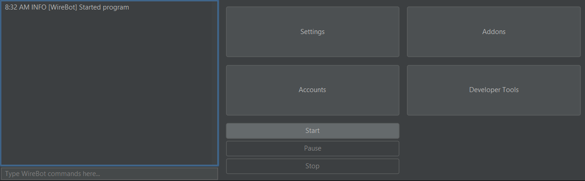

# ServerWrecker

## Description

Advanced Minecraft Server-Stresser Tool

## Features

* Graphical user interface
* Command line interface
* Configurable amount and join delay
* Configurable target
* Configurable name format or name list
* LogPanel to see errors directly
* Test with Spigot, Paper, Purpur, Bungeecord, Velocity
* Disconnects gracefully after the end
* Automatically registers for cracked servers
* Supports SOCKS proxies

## Requirements

* Java 15
* Minecraft 1.8+ server

## Building

1. Download Apache [Maven](https://maven.apache.org/download.cgi)
2. Unpack it
3. Optionally add the bin folder to your PATH variable to invoke Maven with mvn without specifying the complete path to
   the bin folder for every command
4. Download this project with Git (git clone <URL/git@github:...>) or as zip
5. Move to the top folder of the project conting the pom.xml
6. Run `mvn clean install`
7. The final version is inside the core/target folder

## Community

Feel free to join our discord community server:

## Images

## Command Line Usage

To run ServerWrecker from the command line without a GUI, enter  
`java -jar serverwrecker.jar <options>`.

These are the available options:

| Name                  | Description                                                                                                   |
|-----------------------|---------------------------------------------------------------------------------------------------------------|
| -h, --host \<arg\>    | The hostname to connect to. Defaults to `127.0.0.1`                                                           |
| -p, --port \<arg\>    | The port to connect to. Defaults to `25565`                                                                   |
| -c, --count \<arg\>   | The amount of bots to connect to the server. Defaults to 20                                                   |
| -d, --delay \<arg\>   | The delay between bot spawns, in milliseconds. Defaults to 1000                                               |
| -n, --name \<arg\>    | The format for bot names. Requires exactly one integer placeholder `%d`. Defaults to `Bot-%d`                 |
| -v, --version \<arg\> | The Minecraft version of the server to connect to. Defaults to 1.15.2                                         |
| -r, --register        | Makes Bots run the /register and /login command after joining with username and password being `ServerWrecker` |
| --help                | Displays a help page                                                                                          |

## Dependencies

* Java 15
* McProtocolLib: https://github.com/Steveice10/MCProtocolLib
