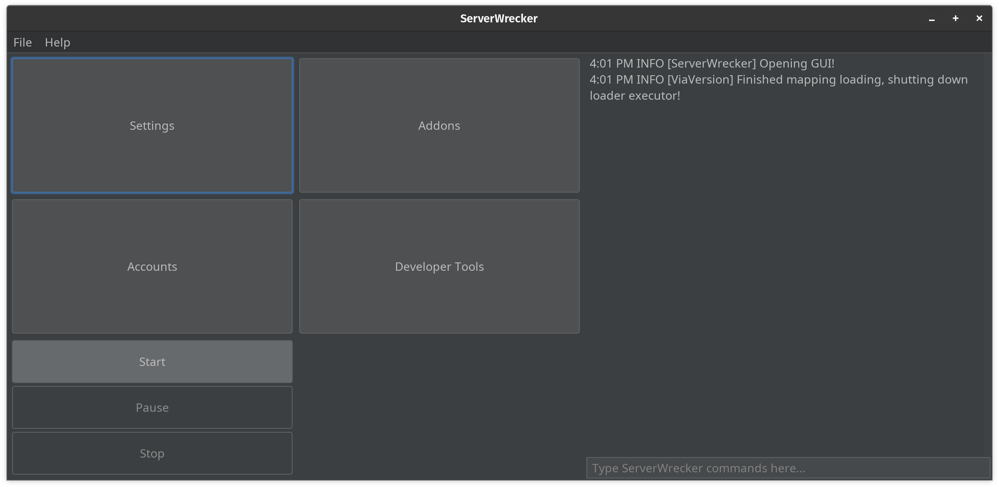

# SoulFire

<!--suppress HtmlDeprecatedAttribute -->
<p align="center">
<a href="https://ci.codemc.io/job/AlexProgrammerDE/job/SoulFire/"></a>
<a href="https://github.com/AlexProgrammerDE/SoulFire/actions/workflows/build.yml"></a>
<a href="https://github.com/AlexProgrammerDE/SoulFire/graphs/contributors"></a>
<a href="https://github.com/AlexProgrammerDE/SoulFire/blob/main/LICENSE"></a>
<a href="https://github.com/AlexProgrammerDE/SoulFire/releases/latest"></a>
<a href="https://github.com/AlexProgrammerDE/SoulFire/releases/latest"></a>
<a href="https://github.com/AlexProgrammerDE/SoulFire/releases/latest"></a>
</p>
<p align="center"><a href="https://discord.gg/vHgRd6YZmH"></a></p>

<p align="center">
<a href="https://github.com/AlexProgrammerDE/SoulFire/releases/latest"></a>
<a href="https://nightly.link/AlexProgrammerDE/SoulFire/workflows/build/main/SoulFire.zip"></a>
</p>

Advanced Minecraft Server-Stresser Tool. Launch bot attacks on your own servers to stress-test them and measure
performance.

---

> [!WARNING]
> This is a very powerful tool that shall only be used to attack your own servers. Ensure your own DDoS protection provider and your host are okay with stress-tests. If you use this software to attack others, you make yourself (or your legal guardians) criminally liable, the developers of SoulFire are not responsible for your own actions.

---

## 🚀 Features

* GUI (Multiple themes) & CLI
* Configurable options for every attack like the number of bots, join delay and more
* Load and save profiles for quick access
* Support for online and offline mode servers
* Supports [almost every Minecraft version](#-version-support)
* Use Microsoft, The Altening, EasyMC or Offline accounts
* Use HTTP/SOCKS4/SOCKS5 proxies
* Multiple [built-in plugins](#-built-in-plugins) like AutoRespawn, AutoJump, ClientSettings and more
* Console command support
* A* Pathfinding (Diagonal moves, parkour, mining blocks, placing blocks)

## ✨ Nightly builds

You can download the latest development version of SoulFire
through [nightly.link](https://nightly.link/AlexProgrammerDE/SoulFire/workflows/build/main/SoulFire.zip).

## 🔭 Requirements

* Java 21+
* Minecraft server (Tested with Spigot/Paper/Purpur/Folia, Velocity/BungeeCord)

## 🍿 Version support

SoulFire supports many version of Minecraft, including releases, april fools snapshots, beta, alpha, classic (including [CPE](https://wiki.vg/Classic_Protocol_Extension)) and even Minecraft Bedrock edition,
and that includes every single subversion, not just a few specific versions.

You can find a up-to-date list of supported versions in [VERSIONS.md](./VERSIONS.md).

### How does this work?

Thanks to a built-in implementation of [ViaVersion](https://github.com/ViaVersion/ViaVersion),
[ViaLegacy](https://github.com/RaphiMC/ViaLegacy), [ViaBedrock](https://github.com/RaphiMC/ViaBedrock) and many others,
a SoulFire bot can connect to all these versions even without the server having ViaVersion installed.
The packet translation happens "client/bot side".
This feature takes inspiration from services like [VIAaaS](https://github.com/ViaVersion/VIAaaS)
and [ViaProxy](https://github.com/RaphiMC/ViaProxy),
which include client-side translation externally.

## 🎬 Videos

[Download & install SoulFire](https://youtu.be/X9hREa17yAo)

## ⌨ Commands

For a list of all available commands, look at [COMMANDS.md](./COMMANDS.md)
or run `help` in the GUI or CLI.

## 📻 Built-in plugins

### AutoRespawn

Automatically respawns bots with a random delay when they die.
Bots do not cause a lot of lags when they are dead, so this module is useful for ensuring
that the bots are always alive and performing their actions.

### AutoRegister

Automatically runs `/register` and `/login` on cracked servers.
Also supports `/captcha` for servers that have it.

### AutoJump

Automatically jumps with a random delay.
Useful for slowing the server down.
It will also make the bots send a lot of movement packets,
which is useful for testing the server's performance.

### ClientSettings & ClientBrand

Configurable client settings like chat visibility, chat colours, skin customization, and more.
Client brand can also be changed to any string; by default, it's set to "vanilla".
Useful for bypassing anti-bot plugins that check for client settings.

## 🗃 Import accounts & proxies

### Accounts

SoulFire supports Microsoft, The Altening and Offline accounts.

If no account is selected, SoulFire will generate offline accounts based on the configured name format.

Select the account type in the GUI or CLI and use one of these formats with one account per line:

#### Microsoft

```text
email:password
email2:password2
email3:password3
```

#### The Altening

```text
token@alt.com
token2@alt.com
token3@alt.com
```

#### Offline

```text
Username
Username2
Username3
```

### Proxies

SoulFire supports HTTP, SOCKS4 and SOCKS5 proxies.

Select the proxy type in the GUI or CLI and use one of these formats with one proxy per line:

#### HTTP

```text
ip:port <- no authentication
ip:port:username:password <- authentication
```

#### SOCKS4

```text
ip:port <- no authentication
ip:port:username <- authentication (socks4 doesn't support passwords)
```

#### SOCKS5

```text
ip:port <- no authentication
ip:port:username:password <- authentication
```

## 🧵 Demo

SoulFire has a built-in GUI for easy usage.


## 💻 Command Line Usage

To run SoulFire from the command line without a GUI, enter:
`java -jar SoulFire.jar <flags>`

> **Note:** Some features are not available in CLI mode, we recommend using the GUI.

For a list of all available CLI flags, look at [CLI_FLAGS.md](./CLI_FLAGS.md)
or run `java -jar SoulFire.jar --help`.

## 🔧 Build from source

1. Install Java 21+
2. Download the latest source code from GitHub
3. Run `./gradlew build` in the project directory
4. Get the jar file from `build/libs`

## 👨‍💻 Developer API

SoulFire offers a Developer API to create your own plugins using the plugin API and mixins.
The software may regularly have breaking changes, so you'll have to stick to a version of SoulFire or update your plugin regularly.

To learn more about the Developer API, take a look at the official [plugin example](https://github.com/AlexProgrammerDE/SoulFirePluginExample).

## 🌈 Community

Feel free to join our Discord community server:

[](https://discord.gg/vHgRd6YZmH)

This project is in active development, so if you have any feature requests or issues, please submit them here on GitHub.
PRs are welcome, too.

## 🌟 Star History

<a href="https://star-history.com/#AlexProgrammerDE/SoulFire&Date">
  <picture>
    <source media="(prefers-color-scheme: dark)" srcset="https://api.star-history.com/svg?repos=AlexProgrammerDE/SoulFire&type=Date&theme=dark" />
    <source media="(prefers-color-scheme: light)" srcset="https://api.star-history.com/svg?repos=AlexProgrammerDE/SoulFire&type=Date" />
    
  </picture>
</a>
