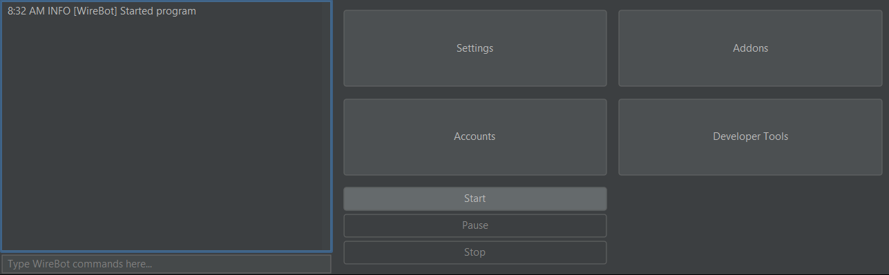

# ServerWrecker

Advanced Minecraft Server-Stresser Tool

## Nightly builds

You can download the latest development version of ServerWrecker through [nightly.link](https://nightly.link/AlexProgrammerDE/ServerWrecker/workflows/build/main/ServerWrecker.zip).

## Features

* GUI & CLI
* Configurable amount of bots and join delay
* Configurable target
* Configurable name format or name list
* Huge version support
* Tested with Spigot, Paper, Purpur, Folia, Velocity/Bungeecord
* Disconnects gracefully after the end
* Multiple modules like AutoRespawn and AutoRegister for cracked servers
* Supports SOCKS4 and 5 proxies

## Version support

ServerWrecker currently supports these versions:
- Release (1.0.0 - 1.19.4 (latest))
- Beta (b1.0 - b1.8.1)
- Alpha (a1.0.15 - a1.2.6)
- Classic (c0.0.15 - c0.30 including [CPE](https://wiki.vg/Classic_Protocol_Extension))

This includes every single subversion, not just a few specific versions.

### How does this work?

Thanks to a built-in implementation of [ViaVersion](https://github.com/ViaVersion/ViaVersion) and [ViaLegacy](https://github.com/RaphiMC/ViaLegacy), a ServerWrecker bot can connect to all these versions even without the server having ViaVersion installed. The packet translation happens "client/bot side".
This feature takes inspiration from services like [ViAaaS](https://github.com/ViaVersion/VIAaaS) and [ViaProxy](https://github.com/RaphiMC/ViaProxy), which include client-side translation externally.
ServerWrecker includes a similar implementation as these two proxies and is comparable functionality wise to [ViaFabric](https://github.com/ViaVersion/ViaFabric).

### What's the catch?

Currently versions below r1.7.0 only support offline-mode,
but a future version will support online-mode servers as well.
All versions newer than r1.7.0 support online-mode.

## Requirements

* Java 17
* Minecraft server

## Building

1. Download Gradle
2. Download the latest version of ServerWrecker
3. Run `./gradlew build` in the serverwrecker directory
4. Get the jar files from `build/libs`

## Community

Feel free to join our discord community server:

## Images

## Command Line Usage

To run ServerWrecker from the command line without a GUI, enter  
`java -jar serverwrecker.jar <options>`.

